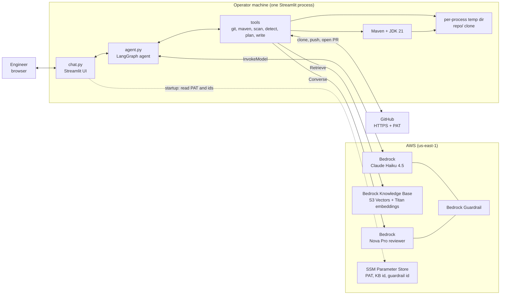
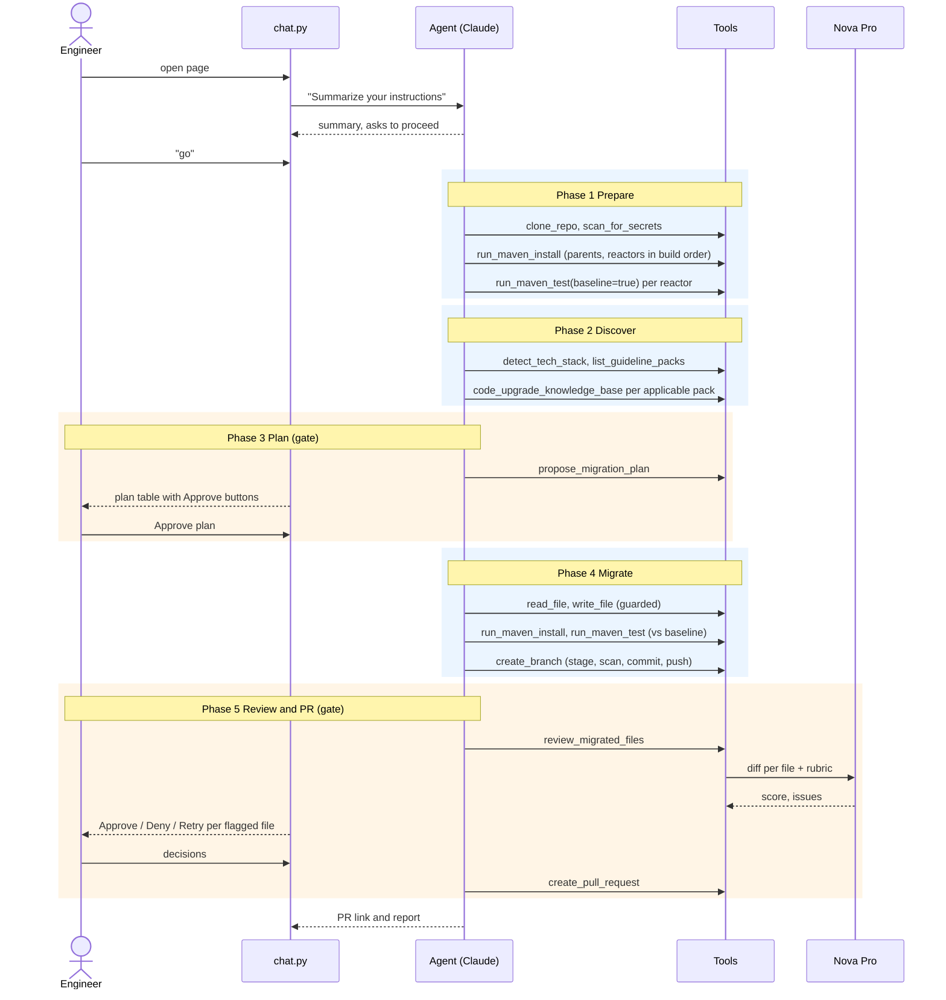
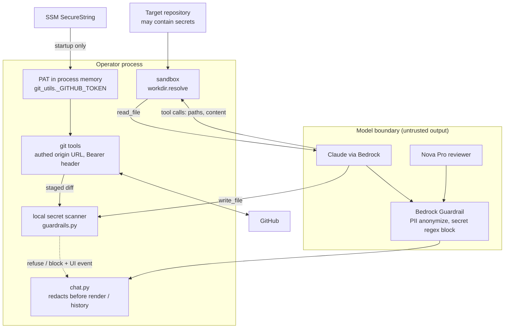
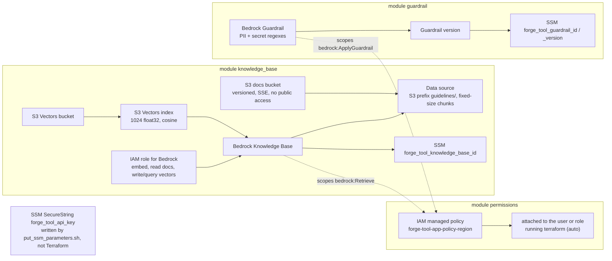

# forge-tool architecture

How the pieces fit together, for engineers who maintain or extend forge-tool.
For installation and day-to-day usage see the [README](../README.md); this document
explains the structure behind it: components, the turn model, tool contracts, where
state lives, trust boundaries, infrastructure and how to extend the system.

Everything here is derived from the code as of October 2026. When the two disagree,
the code wins and this file needs a fix.

## 1. Purpose and scope

forge-tool migrates the tech stack of a J2EE / Maven application and opens a pull
request with the result. You point it at a GitHub repository and an upgrade goal such
as "Java 21"; an agent clones the repo, detects what the code actually uses, matches
that against the company's guideline packs, proposes a migration plan, migrates the
approved items, runs the Maven tests against a pre-migration baseline, has a second
model review every changed file, and opens the PR. It then stays in a chat session so
a human can approve, reject or redirect each step.

Deliberately out of scope:

- It is a single-operator, single-run tool. One Streamlit process holds one working
  copy; it is not a multi-tenant service.
- It never merges. The output is a branch and a pull request; humans merge.
- It never remediates secrets it finds. It reports them, refuses to copy them, and
  replaces them with environment placeholders when a migration must rewrite the file.
- Gradle and Ant repositories are detected but not migrated (the build tool is
  reported, and the corresponding pack is `detect-only`).

## 2. System context



Three facts shape everything else:

1. **One process, one run.** The agent, the sandbox directory and the clone are created
   once per Streamlit process (`st.cache_resource`) and shared by every browser tab.
   Module-level state (queues, the test baseline, the PAT) is process-wide too.
2. **The model never holds credentials.** The GitHub PAT is read from SSM into process
   memory at startup and used only inside tools. It is not in the prompt, the chat
   history or any Bedrock request.
3. **Tools return strings, never raise.** Every tool resolves paths through the sandbox,
   returns `ERROR: …` on failure, and reports to the UI through thread-safe queues.
   An exception escaping a tool aborts the whole turn, so none are allowed to.

## 3. Runtime components

All runtime code is in [`python/`](../python/). The modules form two layers: the UI
and bootstrap layer, which touches Streamlit, and the agent and tool layer, which never
does (tools can run on worker threads where `st.*` is not available).

| Module | Responsibility | Key functions | State it owns |
| --- | --- | --- | --- |
| [`chat.py`](../python/chat.py) | Streamlit page: renders history, streams a turn step by step, shows the plan / secret / manual-review panels, handles the step-limit pause and the Continue button | `stream_turn`, `open_chat`, `render_migration_plan`, `render_secret_blocks`, `render_manual_reviews`, `_queue_turn`, `_decide` | `st.session_state`: `messages`, `migration_plan`, `secret_blocks`, `manual_reviews`, `approved_files`, `pending_input`, `offer_continue` |
| [`config_upgrade_code.py`](../python/config_upgrade_code.py) | Bootstrap, cached for the process lifetime: parse `--github_url` / `--upgrade_details`, read the PAT from SSM, create the sandbox, build the agent and its prompt | `setup_upgrade_code` (`@st.cache_resource`), `config_upgrade_code` | the temp dir path (handed to `workdir`) |
| [`agent.py`](../python/agent.py) | The Bedrock model, the five-phase prompt, the tool registry, the Maven runner with its test baseline, the plan tool, the guarded `write_file`, the secret scan tool, the knowledge-base tool | `Claude.__init__`, `Claude.create_prompt`, `Model.stream`, `_run_maven`, `_parse_surefire`, `propose_migration_plan`, `make_guarded_write_tool`, `load_kb_tool` | `_TEST_BASELINE` (per directory), `_MAVEN_LOCK` |
| [`git_utils.py`](../python/git_utils.py) | Clone, branch, commit, push, status, restore and the GitHub pull-request API; the commit gate | `clone_repo`, `create_branch`, `git_commit`, `git_status`, `git_restore_file`, `create_pull_request`, `_stage_and_scan`, `_run_git` | `_GITHUB_TOKEN` |
| [`guardrails.py`](../python/guardrails.py) | Secret patterns, text / tree / diff scanners, output redaction, the manual-review queue | `scan_text`, `scan_tree`, `scan_diff`, `redact`, `enqueue_manual_review`, `drain_manual_reviews` | `_REVIEW_QUEUE` |
| [`reviewer.py`](../python/reviewer.py) | Nova Pro second opinion: diff each changed file against the source branch, score it 0 to 10, flag low scores | `MigrationReviewer.review`, `review_migrated_files` | a lazily built reviewer client |
| [`techstack.py`](../python/techstack.py) | Deterministic stack detection and pack matching: poms, dependency index, frameworks, legacy libraries, javax / jakarta imports, app server, pack rules, dependency ordering | `detect`, `summarize`, `load_packs`, `match_packs`, `_eval_rule`, `_ordered`, `detect_tech_stack` | none (pure functions over one `Repo` scan) |
| [`workdir.py`](../python/workdir.py) | The sandbox every tool path is anchored to and checked against | `set_working_dir`, `resolve`, `relative` | `_WORKING_DIR` |
| [`ui_events.py`](../python/ui_events.py) | Events raised inside tools for the UI: secret-guardrail blocks and the proposed plan | `push_secret_block`, `drain_secret_blocks`, `set_migration_plan`, `take_migration_plan` | `_SECRET_BLOCKS`, `_MIGRATION_PLAN` |
| [`settings.py`](../python/settings.py) | Every tunable, read from the repo-root `.env` with exported variables taking precedence | `env_str`, `env_int`, `env_bool`, `env_list`, `resolve_path` | module constants |
| [`utils.py`](../python/utils.py) | Logging, SSM reads, resolution of the knowledge-base id and the guardrail config (`.env` first, SSM second) | `get_logger`, `get_config`, `get_knowledge_base_id`, `get_guardrail_config` | none |

### Model and agent construction

`Claude.__init__` builds a `ChatBedrock` client (Bedrock InvokeModel API) with the
boto3 timeouts and retry budget from settings, attaches the Bedrock guardrail when one
resolves, binds the tools, and wraps the result in LangChain's `create_agent`, which is
a LangGraph graph with two nodes: the model node and the tools node. `Model.stream`
runs that graph with `stream_mode="values"`, so the UI receives the full message list
after every node and can diff consecutive lists to show what just happened.

The tool list is assembled in this order (22 tools when everything is enabled):
`run_maven_test`, `run_maven_install`, `create_pull_request`, `clone_repo`,
`create_branch`, `get_current_timestamp`, `git_commit`, `git_restore_file`,
`git_status`, `scan_for_secrets`, `detect_tech_stack`, `list_guideline_packs`,
`propose_migration_plan`, `list_migration_files`, `check_pack_acceptance`, `check_test_parity`, `next_migration_files`, the guarded `write_file`, then `read_file` and
`list_directory` from LangChain's `FileManagementToolkit` scoped to the sandbox,
`review_migrated_files` when `REVIEWER_ENABLED` is true, and
`code_upgrade_knowledge_base` when a knowledge-base id resolves. A missing knowledge
base or guardrail is logged and skipped, never fatal.

## 4. A run, end to end

The prompt (`PROMPT_TEMPLATE` in `agent.py`) drives five phases. Two of them end in a
hard stop that only the human can release.



### Phases in detail

| Phase | What the agent does | Hard stop |
| --- | --- | --- |
| 1 Prepare | `clone_repo` into `repo/` at the source branch; `scan_for_secrets`; install parent / BOM poms and reactors in build order; `run_maven_test(baseline=true)` per reactor | no |
| 2 Discover | `detect_tech_stack` (versions and usage from the code, not from docs); `list_guideline_packs`; knowledge-base queries for every applicable pack | no |
| 3 Plan | `propose_migration_plan` with one item per applicable pack in dependency order; in-scope items reach the goal, the rest are optional; `detect-only` packs become manual items | **yes**, when `MIGRATION_PLAN_APPROVAL` is true the agent must not edit a file until the user approves |
| 4 Migrate | edit only the approved items following the packs' transform guidance; placeholders instead of secrets; tests compared against the baseline; `create_branch` commits and pushes | no |
| 5 Review and PR | `review_migrated_files`; flagged files wait for per-file decisions; then `create_pull_request` with the stack summary, the plan table, the test comparison, the review scores, the secret findings and a "Configuration required" section | **yes**, flagged files block the PR until decided |

### The turn model

A *turn* is one user message and everything the agent does before it answers. Inside a
turn the LangGraph loop alternates model node and tools node; each node execution is
one *step*, and `AGENT_RECURSION_LIMIT` caps the steps per turn (default 400).

What survives between turns, and what does not:

| State | Lives in | Survives a turn | Survives a server restart |
| --- | --- | --- | --- |
| The clone and every edit | sandbox temp dir | yes | no (new temp dir, re-clone) |
| Test baseline (`_TEST_BASELINE`) | `agent.py` module global | yes | no |
| Chat history | `st.session_state.messages` | yes, but only the user text and the **final** assistant text of each turn; tool calls and tool results are not carried into the next turn | no |
| Plan, secret events, manual reviews, approved files | `st.session_state` | yes | no |
| The PAT | `git_utils._GITHUB_TOKEN` and the clone's `origin` URL | yes | re-read from SSM |

Because tool context is not carried over, the prompt tells the agent to re-orient with
`git_status` when it resumes. When a turn hits the step limit, `stream_turn` turns
LangGraph's `GraphRecursionError` into `StepLimitReached`, `open_chat` shows the
agent's last progress note, appends a pause note to the history and offers a
**Continue where it left off** button, which queues a message exactly as if the user had
typed it. The working copy is untouched; the next turn starts with a fresh step budget.

Buttons never call the agent directly. Every button writes `pending_input` and reruns
the script; the main block consumes it as this turn's user message. That keeps one code
path for typed and clicked input.

## 5. Tool contracts

Conventions shared by every tool:

- **Paths** are relative to the sandbox (`repo/...`) or absolute inside it.
  `workdir.resolve` canonicalises with `realpath` and refuses anything outside the
  sandbox with a `ValueError`, which the tool turns into an `ERROR:` string.
- **Errors are results.** Tools return `ERROR: …` and let the model decide. LangGraph's
  default tool-error handler re-raises non-argument exceptions, which would end the
  turn, so tools catch everything they expect.
- **No shell.** Git and Maven run as argv lists with `cwd` passed per call; the model's
  strings are never interpolated into a shell command.
- **UI events** go through `ui_events` / `guardrails` queues; the chat drains them after
  every step (`on_step`) and after the turn.

| Tool | Input | Returns | Side effects |
| --- | --- | --- | --- |
| `clone_repo(url, repo_dir, branch="")` | repo URL, dir name, branch | `Cloned …` or `Already cloned at …` plus usage hints | writes the clone with the authed origin URL and the bot author; idempotent |
| `scan_for_secrets(path)` | dir or file | redacted findings and the placeholder rule, or `No secrets detected` | pushes a `found in repository` event |
| `detect_tech_stack(repo_dir)` | clone dir | JSON: `build`, `java`, `frameworks`, `legacy_libraries`, `namespace`, `app_server`, `docs`, `packs`, `summary` | none |
| `list_guideline_packs()` | none | one line per pack: id, tier, title, depends_on, decisions, status | none |
| `code_upgrade_knowledge_base(query)` | free text | top `KNOWLEDGE_BASE_NUM_RESULTS` chunks with their S3 source, or an `ERROR:` the model can ignore | Bedrock `Retrieve` |
| `propose_migration_plan(plan_json)` | `{goal, summary, items[{component, current, target, pack, scope, in_scope, risk, notes}]}` | validation errors, or an instruction to stop and wait when approval is required | sets the plan the UI renders |
| `read_file`, `list_directory` | sandbox-relative path | file text / listing | none (LangChain toolkit, `root_dir` = sandbox) |
| `write_file(file_path, text, append=False)` | sandbox-relative path, content | `ERROR: write refused…` when the text contains secret material, else the write result | pushes a `write refused` event on refusal |
| `run_maven_install(code_dir)` | dir with a pom | structured summary + log tail of `mvn -B -U clean install -DskipTests` | installs into `~/.m2`; serialized |
| `run_maven_test(code_dir, baseline=False)` | dir with a pom | summary: status, compile / pom errors, test counts, failing `Class.method`, reactor status, baseline comparison, log tail (`MAVEN_OUTPUT_MAX_CHARS`) | records or compares the baseline; serialized |
| `create_branch(repo_file_path, commit_message, branch_name="")` | clone dir, message | `Pushed branch 'forge-upgrade-<ts>' …` with the name to reuse, or the commit-gate error | `git add -A`, diff scan, branch create / checkout, commit, push |
| `git_commit(repo_file_path, commit_message, branch_name="")` | clone dir, message | `Pushed follow-up commit to …` or `No changes to commit` | same gate, current branch by default |
| `git_status(repo_file_path)` | clone dir | branch, upstream, uncommitted files, last 5 commits | none |
| `git_restore_file(repo_file_path, file_path)` | clone dir, repo-relative file | `Restored …` | `git checkout origin/<source> -- file` |
| `review_migrated_files(repo_file_path, upgrade_details, file_paths="")` | clone dir, goal, optional file list | per-file score and issues; instruction to wait when files are flagged | Nova Pro calls; enqueues flagged files for the UI |
| `create_pull_request(github_url, branch_name, pr_title, pr_description)` | repo URL, pushed branch, title, body | the GitHub response, or `ERROR: PR gate refused` with every open item | runs the PR gate (clean and pushed, final tests compile with no new failures at the current commit, packs clean or explained, test parity), appends a generated verification section, `POST /repos/{slug}/pulls` (draft when `PR_GATE=draft` and the gate fails) |
| `next_migration_files(repo_dir="repo", limit=8)` | clone dir, batch size | the next MUST CHANGE files of the approved, non-waived packs with their packs, in a fixed order (main code, resources/webapp/config, tests), and progress | none |
| `check_test_parity(repo_dir="repo")` | clone dir | changed test files that lost tests, assertions or expected values | flagged files go to the manual-review queue |
| `list_migration_files(repo_dir="repo", pack_ids="")` | clone dir; pack ids or empty for the approved plan | MUST CHANGE files grouped by module, each with its packs in order; VERIFY ONLY counts; selectors not evaluated | none |
| `check_pack_acceptance(repo_dir="repo", pack_ids="")` | clone dir; pack ids or empty | per pack: CLEAN or leftovers as `file:line`, `count_unchanged` vs the source branch, manual checks | none |
| `get_current_timestamp()` | none | `datetime.now()` | none (branch names no longer depend on it) |

### The Maven runner

`_run_maven` is the one place Maven is invoked. It holds `_MAVEN_LOCK` around the
subprocess, because the model may issue several Maven calls in one step and LangGraph
runs them on parallel threads; builds share `~/.m2` and file-based H2 test databases,
so parallel runs fail for reasons unrelated to the code.

The result is parsed before it reaches the model (`_parse_surefire`): module totals,
failing tests normalised to `Class.method` across Surefire 2 and 3 formats, compile
errors, pom model errors, per-module reactor status. Only the last
`MAVEN_OUTPUT_MAX_CHARS` of the raw log follow. A `baseline=true` run stores the failing
set per resolved directory; later runs report **new** (fix), **pre-existing** (report in
the PR) and **fixed**. A baseline whose build never reaches the test phase is recorded as
such, so nothing in that reactor is later mistaken for pre-existing.

## 6. Knowledge base and guideline packs

The packs in [`knowledge-base/`](../knowledge-base/) serve two consumers:

- **Locally**, `techstack.load_packs` parses each pack's YAML front matter so
  `detect_tech_stack` can decide, deterministically, which packs apply to a repo and in
  which order.
- **In Bedrock**, the same files are uploaded to the docs bucket and ingested into the
  knowledge base, so the agent can retrieve each pack's `## transform` guidance by
  semantic search while migrating.

### Pack front matter

```yaml
id: spring-to-spring6          # referenced by depends_on, plan items and evidence
title: Spring 5 -> Spring 6
tier: framework                # build | language | namespace | framework | persistence | view | test | platform
status: detect-only            # optional; present = recognised but no transform guidance yet
detect:
  any:                         # a match on any rule applies the pack
    - dependency: "org.springframework:spring-core"
    - dependency_lt: {coord: "org.springframework:spring-core", value: "6.0.0"}
    - import_prefix: "javax.servlet"
    - file_glob: "**/struts*.xml"
    - content_match: {glob: "**/*.java", pattern: '\bjavax\.servlet\b'}
    - property_lt: {name: maven.compiler.release, value: "21"}
    - gradle_property_lt: {name: sourceCompatibility, value: "21"}
    - xml_element: "http://xmlns.jcp.org/xml/ns/javaee:web-app"
    - decision_equals: {key: container, value: tomcat}   # a gate: unmet = pack listed under packs.gated
  all: []                      # optional; every rule must match
depends_on: [javax-to-jakarta] # topological order for the plan
decisions: []                  # decisions the user must make (surfaced by list_guideline_packs)
applies_to: [...]              # file selectors for the transform (informational for the agent today)
eliminates: [...]              # artifacts that disappear after the migration
acceptance: [...]              # checks a finished migration must satisfy (informational today)
```

`_eval_rule` evaluates one rule against the facts gathered by a single repository walk
(`Repo`): parsed poms with property resolution, a `group:artifact` dependency index
including managed dependencies, every imported package, gradle properties, and file
globs. A malformed rule degrades to "did not match"; it never breaks detection.
`match_packs` combines `any` / `all`, keeps the evidence string for every hit, and
records unmet `decision_equals` gates. `_ordered` sorts the matched packs so that
dependencies come first; the agent plans and migrates in that order.

### How packs reach Bedrock

`./infra/deploy.sh --sync` (or `--sync-only`) runs `aws s3 sync knowledge-base/
s3://<docs bucket>/guidelines/ --delete` and then `aws bedrock-agent
start-ingestion-job`. The data source chunks documents at 500 tokens with 20 percent
overlap (configurable), embeds them with Titan Text Embeddings v2 at 1024 dimensions,
and stores the vectors in an S3 Vectors index. The retriever asks for the top
`KNOWLEDGE_BASE_NUM_RESULTS` chunks with `vectorSearchConfiguration`.

### Adding a pack

1. Create `knowledge-base/<id>.pack.md` with the front matter above and a
   `## transform` section written for the agent (what to change, the traps, how to verify).
2. Run `./infra/deploy.sh --sync-only` so the knowledge base has the guidance.
3. Nothing in Python changes: detection picks the pack up from the directory on the
   next `detect_tech_stack` call. The server does not need a restart for a new pack,
   only for code changes.

### How files are picked for migration

Detection decides which packs apply. `list_migration_files` then evaluates the approved packs'
`applies_to` selectors into one inventory (`file → [packs in depends_on order]`, must change
or verify only); the agent edits each file once with all its packs applied in order, and
`check_pack_acceptance` evaluates each pack's `acceptance` rules. The pack set is frozen at
plan approval. Diagrams, rule evaluation and example output are in
[file-selection.md](file-selection.md). Each stage of a run has its own page under
[stages/](stages/); see the [docs index](README.md).

## 7. Security architecture



### Trust boundaries

- **The model is untrusted input.** Everything it produces (paths, file contents, commit
  messages, plan JSON) is validated by the tools: paths through the sandbox, content
  through the scanner, the plan through a schema check.
- **The repository is untrusted data.** It may contain secrets and arbitrary build
  scripts. Maven runs with the operator's privileges on the operator's machine; that is
  an accepted risk of a local tool, and the reason it is not a shared service.
- **Credentials live only in the operator process.** The PAT path is SSM SecureString →
  `get_config` (decrypted) → `configure_github_token` → `_authed_https_url`, which embeds
  `x-access-token:<PAT>@github.com` in the clone's `origin` URL, and `GitHubProvider`'s
  `Authorization: Bearer` header. `_sanitize` strips it from every logged URL and git
  message. The token therefore also sits in the clone's `.git/config` inside the temp
  dir for the life of the process.

### Four secret-scan points

All four use the patterns in `guardrails.SECRET_PATTERNS`. Each pattern has a severity:
**secret** (private and symmetric keys including `SecretKeySpec` literals, byte-array keys and
`*KEY` constants, AWS keys, GitHub / Slack tokens, JWTs, passwords including prefixed constants
and Liberty variable defaults, API keys) or **public** (PEM and base64 X.509 public keys).
Only secret findings block writes and commits; public findings are reported and the user
decides. Placeholders such as `${DB_PASSWORD}`, `$(VAR)`, `@VAR@`, `%VAR%`
and `{{ var }}` are removed before matching, because externalised values are the fix,
not a finding. `SECRET_SCAN_ALLOWLIST` suppresses lines matching your own regexes;
`SECRET_SCAN_ENABLED=false` turns the local scanner off everywhere.

| Point | Where | Outcome |
| --- | --- | --- |
| Repository scan | `scan_for_secrets` → `scan_tree` | secrets: reported (redacted) and **always externalized** through the pack `externalize-secrets`, whose acceptance check (`no_secrets: secret`) fails until no literal is left. Public keys: the agent stops and the chat offers **Scrub public keys** (pack `externalize-public-keys`) or **Continue (keep them)** |
| Write | guarded `write_file` → `scan_text(severities=("secret",))` | the write is refused; the chat shows a `write refused` event |
| Commit | `_stage_and_scan` → `scan_diff` on the **added** lines of the staged diff | the index is reset, the push does not happen; `commit blocked` event. Pre-existing secrets in untouched lines do not block |
| Personal data | `scan_for_secrets` → `pii_scan.scan_tree` (Amazon Bedrock ApplyGuardrail with the PII scan guardrail) | reported by type and `file:line`, never the value; listed in the PR; nothing blocked or changed |
| Output | `guardrails.redact` on assistant text, tool-call arguments and tool-result previews before they are rendered or stored | values replaced with `[REDACTED <kind>]` |

### The Bedrock guardrail

Terraform creates one guardrail, attached to both models (`guardrails=` on
`ChatBedrock`, `guardrail_config` on the reviewer's `ChatBedrockConverse`):

- **PII entities** (credential and financial types; the list is `pii_entity_types` in
  [`modules/guardrail/variables.tf`](../infra/terraform/modules/guardrail/variables.tf))
  with action `ANONYMIZE` by default, `BLOCK` via `GUARDRAIL_PII_ACTION`. The configured
  action applies to model **output** only: an ApplyGuardrail probe with `source=INPUT` detects
  nothing, so personal data the model reads is not masked on the way in.
- **Regexes** for PEM / OpenSSH / PGP keys, GitHub tokens, AES or symmetric key
  assignments, Slack tokens and JWTs with `input_action = NONE` and
  `output_action = BLOCK`: a legacy file containing a key must not abort the run when
  the agent reads it, but the model must never echo secret material.

A second guardrail, `<guardrail_name>-pii-scan`, never sits on model traffic. `pii_scan.py`
calls `ApplyGuardrail(source=OUTPUT)` with it over the repository's data-bearing files
(`PII_SCAN_GLOBS`) in chunks of `PII_SCAN_CHUNK_CHARS`, locates each returned match to get its
line, and discards the value. It detects names, emails, phones, addresses and government and
financial identifiers (`pii_scan_entity_types`); results are report-only and appear in the chat
and the PR's verification section. Errors degrade to a note; a per-scan budget
(`PII_SCAN_MAX_CHARS`) bounds cost, and identical chunks are cached.

The app references a numbered guardrail version; Terraform publishes a new version
whenever the guardrail changes (`replace_triggered_by`). Without a guardrail the app
runs with local scanning only and logs that.

### Known gaps

- Personal data the model reads from a repo file reaches the model unmasked: the model
  guardrail's PII action applies to output only. The PII scan reports such files.
- A secret the model reads from a repo file **does** travel to Bedrock in the request
  (input action is `NONE` by design) and is in the model's context; redaction and the
  output block stop it from coming back out.
- The scanner is pattern based. Novel formats, encoded blobs or secrets split across
  lines are not detected.
- Reviewer scores are a quality signal, not a security control; a file can score well
  and still be wrong.

## 8. Infrastructure

All AWS resources are managed by Terraform under [`infra/terraform/`](../infra/terraform/)
(Terraform ≥ 1.6, AWS provider ~> 6.67, `time` provider for IAM propagation). State is
local (`terraform.tfstate`, git-ignored); the S3 backend block in `versions.tf` is the
documented path to a shared state.



| Module | Creates | Notes |
| --- | --- | --- |
| `knowledge_base` | docs bucket, S3 Vectors bucket + index, Bedrock service role, knowledge base (`S3_VECTORS` storage), S3 data source, SSM id parameter | both buckets `force_destroy`; a 15 s `time_sleep` lets the new role propagate before the KB is created; chunk text is non-filterable metadata to stay within the metadata budget |
| `guardrail` | model guardrail and the PII scan guardrail, each with a published version and two SSM parameters | versions replaced on every guardrail change; `ApplyGuardrail` in the IAM policy is scoped to both ARNs |
| `permissions` | one managed policy, attached to the IAM user or role derived from the caller (`APP_IAM_PRINCIPAL=auto`, `user:<name>`, `role:<name>` or `none`) | allows `InvokeModel` / `InvokeModelWithResponseStream` on both inference profiles and their foundation models in every region, `Get/ListInferenceProfiles`, `ApplyGuardrail` on the guardrail, `Retrieve` on the KB, `ssm:GetParameter(s)` on the `forge_tool_` prefix and `kms:Decrypt` via SSM |

The PAT is deliberately **not** a Terraform resource: a SecureString in state would copy
the secret into the state file. [`put_ssm_parameters.sh`](../infra/put_ssm_parameters.sh)
writes it with the CLI through a 0600 temp file, sanitises pasted control characters and
validates the token shape.

### deploy.sh

[`deploy.sh`](../infra/deploy.sh) wraps Terraform so that `.env` is the single source
of configuration: every `KB_*`, `GUARDRAIL_*`, `CREATE_*` and model variable is
exported as `TF_VAR_<lowercase>`. Flags select parts with `-target` (`--kb-only`,
`--no-guardrail`, …), `--plan` is read-only, `--delete` destroys everything including
the buckets, and `--sync` / `--sync-only` upload the packs and start ingestion. On
success the knowledge-base id and guardrail id / version are written back to `.env`,
unless the effective `AWS_REGION` came from an exported variable that differs from the
file (`WRITE_IDS=false`), because the ids are region-specific and would point the app at
resources in the wrong region.

Cost shape: S3 Vectors bills per request and per GB with no provisioned capacity, which
is why it replaced OpenSearch Serverless (a standing floor of a few hundred dollars a
month). The guardrail is pay per use. The models are the only significant cost, and they
scale with steps per turn (see section 10).

## 9. Configuration and operations

### Configuration

Everything is in the repo-root `.env`; [`.env.example`](../.env.example) is the
annotated reference and the README has the full table. Precedence is the same in Python
(`load_dotenv(override=False)`) and in the shell scripts (`lib/env.sh`): an exported
variable beats the file.

| Group | Consumed by |
| --- | --- |
| `BEDROCK_*`, `AGENT_RECURSION_LIMIT`, `AGENT_SUMMARY_*`, `MAVEN_OUTPUT_MAX_CHARS` | `agent.py` (client config, step budget, context compaction, Maven tail) |
| `KNOWLEDGE_BASE_*` | `agent.load_kb_tool`, `techstack.load_packs` (directory) |
| `PARAMETER_STORE_PREFIX`, `SSM_PARAMETER_NAMES` | `utils.get_config`, the id / guardrail parameter names |
| `GIT_*`, `GITHUB_*` | `git_utils` (author, source and base branch, API) and `reviewer` (diff base) |
| `DEFAULT_GITHUB_URL`, `DEFAULT_UPGRADE_DETAILS` | `config_upgrade_code` when no CLI flags are passed; `setup.sh` passes them explicitly |
| `GUARDRAIL_*`, `SECRET_SCAN_*` | `utils.get_guardrail_config`, `guardrails` |
| `REVIEWER_*`, `REVIEW_*` | `reviewer.py` |
| `MIGRATION_PLAN_APPROVAL` | `propose_migration_plan` (stop-and-wait vs proceed) |
| `APP_*`, `STREAMLIT_*`, `LOG_*` | `chat.py` page, `setup.sh` launcher, `utils.get_logger` |
| `VENV_DIR`, `PYTHON_BIN`, `JAVA_VERSION`, `JAVA_HOME` | `setup.sh` only |
| `PROJECT_NAME`, `CREATE_*`, `KB_*`, `GUARDRAIL_NAME`, `GUARDRAIL_PII_ACTION`, `APP_IAM_PRINCIPAL`, `*_BASE_MODEL_ID` | `deploy.sh` → Terraform |

### Server lifecycle

[`infra/setup.sh`](../infra/setup.sh) is the only supported way to run the app:

| Command | What it does |
| --- | --- |
| `install` | creates the venv, installs `python/requirements.txt`, checks the JDK |
| `check` | verifies the toolchain and AWS configuration |
| `run` | Streamlit in the foreground with the `.env` defaults as app arguments; output also goes to `app.log` (rotated), so `status` and `stop` see the run |
| `start` | detached (`nohup`), rotating `app.log` to `app.log.1`, waits for `/_stcore/health` |
| `status` | pid, uptime, health, connected browser sessions (`lsof`), run activity from the `app.log` modification time |
| `config` | prints the effective configuration: exported paths, credential source, model / KB / guardrail ids, branches, agent limits, server URL; every value tagged `shell`, `.env` or `default`, secrets shown as set / unset. `install`, `run`, `start`, `restart` and `check` print the same summary when they finish |
| `stop` / `restart` | refuse while a browser is connected or `app.log` changed within `RUN_ACTIVE_MINUTES` (5), because stopping kills the run and discards the temp dir; `--force` overrides |
| `source infra/setup.sh` | only exports `PATH`, `PYTHONPATH` and `JAVA_HOME` |

Operational consequences of the process model:

- **Code changes to tools need a restart.** The agent is cached for the process
  lifetime; Streamlit's hot reload re-imports a changed module but the cached agent
  keeps the old tool objects, and re-imported modules get fresh queue objects, so events
  can go missing. Restart instead of relying on reload.
- **The clone lives as long as the process.** `clone_repo` is idempotent, so a second
  run in the same process reuses the working copy and its branch.
- **Logs.** `app.log` holds the Streamlit output and the `FORGE_TOOL` logger: every tool
  call (`→ name args`) and result preview (`← name: …`), redacted, plus git and Maven
  commands. The JDK is pinned with `JAVA_VERSION` (21 today), resolved via
  `/usr/libexec/java_home` on macOS.

## 10. Failure handling and limits

| Situation | Behaviour |
| --- | --- |
| Step limit reached | pause, not failure: last progress note shown, history gets a pause note, **Continue** button; the working copy keeps everything |
| Transcript grows large mid-turn | `SummarizationMiddleware` replaces older messages with a summary past `AGENT_SUMMARY_TRIGGER_TOKENS` (default 120,000), keeping the last `AGENT_SUMMARY_KEEP_MESSAGES` (30) verbatim |
| Turn ends normally with work left ("still to do") | the chat runs the approved packs' acceptance checks after every turn and, when any is unfinished and no decision is pending, shows the packs and leftover counts with a **Continue** button |
| Bedrock `ClientError` (throttling, validation, context overflow) | the turn ends with "AWS Bedrock Error: …"; the working copy is intact; the user can type `continue` |
| Any other exception in a turn | "An unexpected error occurred: …", same recovery |
| Tool failure | returned to the model as `ERROR: …`; the model retries or reports |
| Knowledge base unreachable | the KB tool returns an error string telling the model to continue without guidelines |
| Model descopes approved work ("out of scope, separate effort") | the PR gate refuses every unfinished approved pack regardless of the description; the chat offers Finish / Accept as not migrated, and only the user's click waives a pack |
| Model claims a broken build is fine ("pre-existing", "all tests pass") | the PR gate decides from the test-run record, not from the model's text; a failure is pre-existing only if the baseline comparison says so |
| A migration rewrites what a test checks | `check_test_parity` flags it, the file goes to manual review, and the PR gate refuses until it is fixed or approved |
| Reviewer failure on a file | that file scores 0 with the error attached, so it lands in manual review rather than silently passing |
| Maven run in parallel | serialized by `_MAVEN_LOCK` |
| Pre-existing test failures | labelled by the baseline comparison; the prompt forbids chasing them |
| Secret in a write / commit | refused / blocked with a chat event and guidance to use a placeholder |

**Step limit versus context window.** Compaction (above) keeps the transcript below the
context window in normal runs. Each model step re-sends the whole turn transcript,
so cost per turn grows faster than linearly with steps and the transcript eventually
exceeds the model's context window (200K tokens for Claude Haiku 4.5). The step limit
should stay low enough that the graceful pause fires before the context error does;
300 to 600 is the practical range for a repo of ams's size. Bedrock timeouts and retries
are `BEDROCK_CONNECT_TIMEOUT`, `BEDROCK_READ_TIMEOUT` and `BEDROCK_MAX_ATTEMPTS`.

## 11. Extending

### Add a tool

1. Write a `@tool` function in the module that owns the side effect (`git_utils.py`
   for git, `agent.py` for build / plan tools, a new module for a new concern).
   Resolve every path with `workdir.resolve`, run subprocesses as argv lists with
   `cwd=`, return `ERROR: …` strings instead of raising, and push UI events through
   `ui_events` rather than calling `st.*`.
2. Register it in the `tools` list in `Claude.__init__`.
3. Mention it in `PROMPT_TEMPLATE` at the phase where it belongs; the docstring is what
   the model sees as the tool description, so write it for the model.
4. Add an offline test: a local bare repository for git tools, a faked `subprocess.run`
   for Maven, synthetic fixtures for detection (see the existing harness pattern).
5. Restart the server.

### Add a pack

See section 6. Detection needs no code change; the knowledge base needs a sync.

### Swap a model

`BEDROCK_MODEL_ID` / `REVIEWER_MODEL_ID` select inference profiles; the matching
`PRIMARY_BASE_MODEL_ID` / `REVIEWER_BASE_MODEL_ID` must name the foundation model behind
them so the IAM policy allows it in every region the profile routes to. Re-run
`./infra/deploy.sh --permissions-only` after changing either, and make sure the model is
enabled in Bedrock model access for the region.

### Add a secret pattern or guardrail rule

Local: append to `SECRET_PATTERNS` in `guardrails.py` (name, regex). The pattern must
require a token prefix or an assignment context so ordinary identifiers do not match.
Bedrock: add to `secret_regexes` in `modules/guardrail/main.tf` and run
`./infra/deploy.sh --guardrail-only`; a new version is published and its number written
to `.env` and SSM.

## 12. Known limitations and future work

- **Compaction loses detail.** Past `AGENT_SUMMARY_TRIGGER_TOKENS` older messages become a
  summary; the agent re-derives specifics through `git_status`, `list_migration_files` and
  `check_pack_acceptance`, which is why those tools are cheap and deterministic.
- **No prompt caching.** Every step pays for the full context again.
- **Only final text persists between turns.** The agent re-derives tool context through
  `git_status` and re-reads files after a pause.
- **Single process, single run.** All queues, the baseline, the PAT and the sandbox are
  module globals; two browser tabs share one working copy. A second concurrent run is
  not supported.
- **Hot reload is unsafe for tool modules.** Restart the server after code changes.
- **The PAT is embedded in the clone's origin URL** inside the temp dir for the life of
  the process.
- **Local Terraform state.** Fine for one operator; move to the S3 backend before a
  second person deploys.
- **Some pack rules stay manual.** `applies_to` selectors such as `selector: tomcat_context`,
  conditional `acceptance` rules (`when: {container: tomcat}`) and the parity checks are
  listed, not evaluated; `eliminates` is guidance only.
- **Detection drifts during a migration.** A pack's detect rules can stop matching once its
  versions are bumped although its work is unfinished (springsec-to-springsec6 on ams). The
  inventory and acceptance tools therefore use the pack set frozen at approval, but
  `detect_tech_stack` itself still reflects the current clone.
- **Baseline reactors that do not build** cannot distinguish pre-existing failures, so
  the first migration of such a reactor reports every failure as new.
