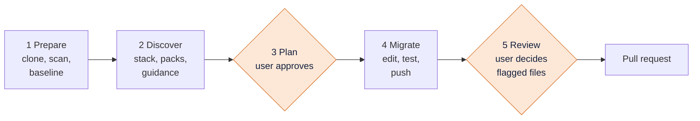

# forge-tool docs

| Document | What it covers |
| --- | --- |
| [ARCHITECTURE.md](ARCHITECTURE.md) | components, turn model, tool contracts, security, infrastructure |
| [file-selection.md](file-selection.md) | how files are picked for migration: today, the target flow, files shared by several packs |
| [WINDOWS.md](WINDOWS.md) | running forge natively on a Windows PC (PowerShell), app only |
| [stages/01-prepare.md](stages/01-prepare.md) | clone, secret scan, test baseline |
| [stages/02-discover.md](stages/02-discover.md) | tech-stack detection, pack matching, knowledge base |
| [stages/03-plan.md](stages/03-plan.md) | the migration plan and the approval gate |
| [stages/04-migrate.md](stages/04-migrate.md) | edits, secret guard, tests vs baseline, branch and push |
| [stages/05-review-and-pr.md](stages/05-review-and-pr.md) | reviewer model, manual review, pull request |

## A run at a glance

The two orange stages are hard stops: the agent waits for the user before it continues.
