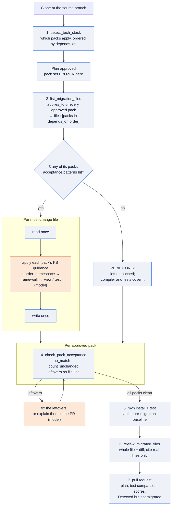
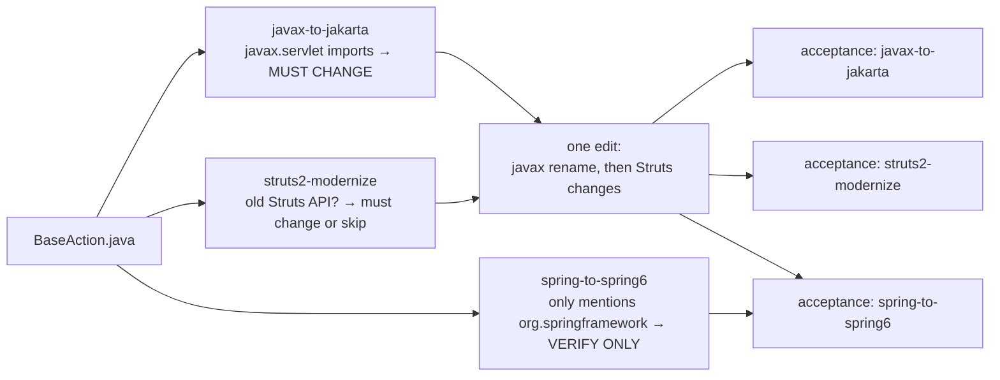

# How files are picked for migration

Reference for how forge-tool decides which files of the target repository a migration
touches. Part of the stage docs: see [the index](README.md). The stage this belongs to is
[Stage 4, Migrate](stages/04-migrate.md).

## Before this change

`detect_tech_stack` decided *which packs* apply, and its evidence named at most three example
files per rule. The packs' `applies_to` and `acceptance` entries were handed to the model as
text and evaluated nowhere, so the agent found files by browsing the clone, coverage depended
on its diligence inside the step budget, and nothing verified completeness before review. On
ams a run reached the review phase with seven `javax.servlet` imports and an
`@EnableGlobalMethodSecurity` still in place. That is what the flow below fixes.

## How it works

Selection is a deterministic inventory built once for the whole approved plan. Each
file is then **edited once**, with every approved pack that selects it applied in dependency
order, and each pack is **verified separately**. Only the edit itself is the model's
judgement; everything else is code evaluating the pack front matter.



Blue boxes are deterministic code; orange boxes are the model's judgement.

## The steps

| Step | What it does | Decided by |
| --- | --- | --- |
| 1 `detect_tech_stack` | one scan of poms, imports and file globs; evaluates every pack's `detect` rules; orders matches by `depends_on` | code, exists today |
| approval | the packs in the approved plan become the **frozen pack set**; later steps use it and never re-run detection | user, then code |
| 2 `list_migration_files` | evaluates the `applies_to` selectors of every approved pack and inverts them into `file → [packs in depends_on order]`, grouped by module. `include_tests` decides whether `src/test` files are in a pack's set, unless the selector itself targets test paths | code |
| 3 split | a file is **must change** for a pack when that pack's `acceptance` patterns hit it; a file with no hit for any of its packs is **verify only** | code |
| edit | per must-change file: read once, apply the guidance of each pack that has work in it, in dependency order, write once | the model |
| 4 `check_pack_acceptance` | per approved pack: re-runs the `no_match` and `count_unchanged` rules and reports every leftover as `file:line`. A leftover names the file **and** the pack that is unfinished | code |
| 5 to 7 | Maven against the baseline, the review, the pull request with a "Detected but not migrated" section | existing tail of a run |

## Files selected by several packs

A file can be selected by more than one pack. Measured on the current ams clone, with eight
applicable packs:

| Files selected by any pack | by 1 pack | by 2 packs | by 3 packs |
| --- | --- | --- | --- |
| 134 | 101 | 29 | 4 |

| File | Packs, in dependency order |
| --- | --- |
| `BaseAction.java`, `HomeAction.java`, `HealthAction.java` | javax-to-jakarta, struts2-modernize, spring-to-spring6 |
| `ReportActionTest.java` | struts2-modernize, junit4-to-junit5, spring-to-spring6 |
| `InstallOrderBaseAction.java`, `ErrorController.java`, `SpecialCharacterInterceptor.java` | javax-to-jakarta, spring-to-spring6 |
| `SecurityHeadersInterceptor.java` | javax-to-jakarta, struts2-modernize |

How such a file is handled:



Rules:

- **Only approved packs apply.** Optional packs the user left out are ignored even when their
  selectors match the file.
- **Only packs with work in the file.** A pack makes the file must-change only when its
  acceptance patterns hit it; otherwise the file is verify-only for that pack.
- **Dependency order inside the edit.** Namespace first, then framework, then view or test
  changes, because each pack's guidance assumes the earlier packs are done.
- **A `detect-only` pack** contributes no edit; the file gets the other packs applied and is
  listed for manual follow-up.
- **Verification stays per pack**, so a leftover says which migration is incomplete.

Why the pack set is frozen at approval: once a migration is partly done, a pack's detect rules
can stop matching even though its work is unfinished. On the ams clone,
`springsec-to-springsec6` no longer appears in `packs.applicable` after the version bump, yet
`@EnableGlobalMethodSecurity` is still in `GlobalSecurityConfig`. Inventory and acceptance
therefore use the approved pack ids, never a fresh detection.

## Rule kinds the packs use

| Front-matter key | Kind | Example | Meaning |
| --- | --- | --- | --- |
| `applies_to` | `file_glob` | `**/spring-security*.xml`, `**/src/test/java/**/*.java` | every file whose repo path matches |
| `applies_to` | `content_match` | `{glob: "**/*.java", pattern: '\bjavax\.(?!sql\|crypto\|…)'}` | files under the glob whose content matches the regex |
| `acceptance` | `no_match` | `{no_match: 'WebSecurityConfigurerAdapter\|antMatchers\|EnableGlobalMethodSecurity'}` | the pattern must not occur anywhere in scope after the migration |
| `acceptance` | `count_unchanged` | JDK `javax.*` imports in the javax pack | the number of matches must equal the count before the migration |
| `acceptance` | `authz_parity`, `test_parity` | Spring Security, JUnit packs | cannot be checked by code; listed for the human reviewer |

## Why the split matters

Some selectors are deliberately broad. Measured on the current ams clone:

| Pack | Files selected by `applies_to` | Notes |
| --- | --- | --- |
| javax-to-jakarta | 7 | exactly the files the last run missed |
| springsec-to-springsec6 | 3 | `GlobalSecurityConfig` flagged by `EnableGlobalMethodSecurity` |
| jsp-jstl-modernize | 19 | 16 already changed by the run |
| struts2-modernize | 21 | most need no change |
| spring-to-spring6 | 62 | every file that mentions `org.springframework` |

Without the split the agent would read 62 files to change a handful. With it the
must-change list is the checklist and the compiler covers the rest.

The springsec row comes from the pack's selectors, even though detection no longer lists that
pack on this clone; the frozen pack set is what keeps it in the run.

## The work queue

`next_migration_files` turns the inventory into an ordered worklist so the agent cannot pick
the easy files and leave the rest: main code first (tests compile against it), then
resources/webapp/config, then tests; within each group, packs in dependency order, then path.
It returns a batch with progress ("13 of 47 files done") and is called until empty. Packs the
user accepted as not migrated and detect-only packs are not queued.

## Helpers and tools

| Function | Returns | Exposed to the agent as |
| --- | --- | --- |
| `techstack.select_files(repo, pack)` | repo-relative paths one pack's `applies_to` selects, plus the selectors code cannot evaluate | used by the inventory |
| `techstack.build_inventory(repo, packs)` | `{file: [{pack, must_change, detect_only}]}`, packs in `depends_on` order | `list_migration_files(repo_dir="repo", pack_ids="")` |
| `techstack.check_acceptance(repo, pack)` | `{clean, leftover_count, leftovers, count_changes, manual_checks}` | `check_pack_acceptance(repo_dir="repo", pack_ids="")` |
| `techstack.resolve_packs(ids)` | pack dicts in `depends_on` order, plus unknown ids | both tools |

**Which packs the tools use.** `pack_ids` (comma-separated) wins when the agent passes it,
which it does in Stage 3 to size the plan. Without it the tools use the **approved** pack set,
frozen by the chat's Approve buttons (`ui_events.approve_packs`); before approval, the
proposed plan's in-scope packs (`ui_events.set_proposed_packs`, called by
`propose_migration_plan`). They never re-run detection.

**How the rules are evaluated.**

| Front matter | Evaluation |
| --- | --- |
| `applies_to: file_glob` / `content_match` | globs anchored at any depth, so `src/**/*.java` also matches `ams-internal/X/src/...`; `src/test/` paths dropped unless `include_tests: true` or the glob itself names tests |
| `applies_to: secret_scan: <severity>` | files where forge's secret scanner (`guardrails.scan_text`) finds material of that severity; shares its patterns, placeholders and allowlist |
| `applies_to: selector: <name>` | not evaluated by code; reported under "NOT EVALUATED" |
| `acceptance: no_match` | every hit in scope is a leftover, reported as `file:line: text` (secrets redacted, max 30 per pack) |
| `acceptance: count_unchanged` | match count now versus the same files at `origin/<GIT_SOURCE_BRANCH>` (read with `git cat-file`); a difference fails the pack |
| `acceptance: … when: {container: tomcat}` | conditional; listed as manual, not evaluated |
| `acceptance: build` | listed as covered by the Maven stage |
| `acceptance: no_secrets: <severity>` | every scanner finding of that severity is a leftover `file:line: <kind> (value redacted)` |
| `acceptance: test_parity` | evaluated by `techstack.test_parity`: every changed test file that lost tests, assertions or expected values (and was not approved by the user) is a leftover |
| `acceptance: authz_parity`, `routing_parity` | listed for the human reviewer |

Both tools resolve paths through `workdir.resolve`, read a fresh `Repo` on every call (so
edits are seen), and return `ERROR: …` strings instead of raising.

## Example output (ams)

```
MUST CHANGE: 31 file(s). Edit each once, applying its packs left to right.
  [ams-internal/AssetManagementInternalWeb]
    src/main/java/org/example/am/internal/web/action/BaseAction.java  <- javax-to-jakarta, struts2-modernize  (verify: spring-to-spring6)
    src/main/java/org/example/am/internal/web/config/GlobalSecurityConfig.java  <- springsec-to-springsec6  (verify: spring-to-spring6)
    ...
VERIFY ONLY: … file(s) selected with nothing known to be wrong: …

javax-to-jakarta: 10 leftover(s)
    ams-internal/AssetManagementInternalWeb/src/main/java/.../BaseAction.java:8: import javax.servlet.http.HttpServletRequest;
    ...
  count_unchanged '^import javax\.(accessibility|…': 8 on origin/simple-app, 8 now (unchanged)
springsec-to-springsec6: … leftover(s)
  manual: authz_parity: for the human reviewer
```
