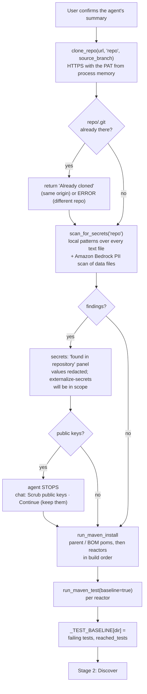

# Stage 1: Prepare

Clone the repository, report secrets already in it, and record a test baseline before
anything changes. [Index](../README.md) · Next: [Stage 2, Discover](02-discover.md)

## Flow



## Steps

| Step | Tool | What happens | Code |
| --- | --- | --- | --- |
| Clone | `clone_repo` | resolves `repo` inside the sandbox, clones `https://x-access-token:<PAT>@github.com/<owner>/<repo>.git` at `GIT_SOURCE_BRANCH`, sets the bot author. Idempotent: a second call returns the existing clone | `git_utils.clone_repo` |
| Secret scan | `scan_for_secrets` | walks every text file (skips `.git`, `target`, `build`, binaries, files over 1 MB), matches the patterns after removing placeholders such as `${DB_PASSWORD}`, returns redacted findings in two groups: secrets and public keys. Then the data-bearing files (`PII_SCAN_GLOBS`) go through the Amazon Bedrock PII scan guardrail, and personal data is reported by type and `file:line` (report only, values never shown) | `agent.scan_for_secrets`, `guardrails.scan_tree` |
| Install | `run_maven_install` | `mvn -B -U -f <dir>/pom.xml clean install -DskipTests` on each parent / BOM pom, then each reactor in build order, so later reactors resolve earlier ones from `~/.m2` | `agent._run_maven` |
| Baseline | `run_maven_test(baseline=true)` | `mvn clean test` per reactor; the failing tests are stored as the pre-migration baseline | `agent._run_maven`, `_TEST_BASELINE` |

## Rules the agent follows here

- Every path is relative to the sandbox: `repo`, `repo/ams-common`, never an absolute path
  outside it.
- Maven calls run one at a time. The tool enforces this with `_MAVEN_LOCK`, because
  parallel builds share `~/.m2` and file-based H2 databases.
- Secret values are never copied, printed or moved. When the scan finds secrets, the plan in
  Stage 3 includes the pack `externalize-secrets` as in scope, always.
- When the scan finds public keys, the agent stops here. **🧹 Scrub public keys** adds
  `externalize-public-keys` to the plan; **▶ Continue (keep them)** leaves them and lists them
  in the PR. Either button resumes the run with the baseline.
- Baseline failures predate the migration. They are reported in the PR, never fixed unless
  a plan item covers them.

## What the Maven result looks like

```
mvn clean test in …/repo/ams-common: FAILED (exit 1)
tests: run 147, failures 0, errors 1, skipped 0
failing tests: ConfigServiceImplTest.allPropertiesComeBackKeyedByPropertyKey
reactor: AMS Common: SUCCESS; Asset Management Shared Common: SUCCESS; …; Asset Management Shared Services: FAILURE
baseline recorded: 1 failing test(s) BEFORE the migration
--- log tail ---
…last MAVEN_OUTPUT_MAX_CHARS characters…
```

A reactor whose build never reaches the test phase (a broken pom, a compile error) is
recorded as such: "baseline recorded: the pre-migration build does not reach the tests".
After the migration every failure in that reactor counts as new.

## On ams today

| Reactor | Baseline |
| --- | --- |
| ams-parent-bom | installs |
| ams-common | 147 tests, 1 pre-existing error (H2 "No data is available" in `ConfigServiceImplTest`) |
| ams-internal | does not build: `AssetManagementInternalWeb/pom.xml` has dependencies without versions |

## Settings

`GIT_SOURCE_BRANCH`, `SECRET_SCAN_ENABLED`, `SECRET_SCAN_ALLOWLIST`, `MAVEN_OUTPUT_MAX_CHARS`,
`JAVA_VERSION` (via `infra/setup.sh`).
