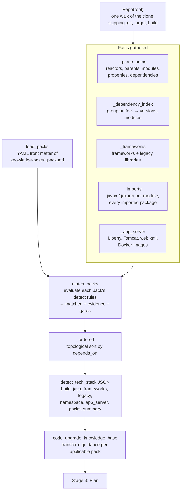

# Stage 2: Discover

Work out what the repository actually is, which guideline packs apply, and what each pack
says to do. [Index](../README.md) · Previous: [Stage 1, Prepare](01-prepare.md) · Next:
[Stage 3, Plan](03-plan.md)

## Flow

## Steps

| Step | Tool | What happens |
| --- | --- | --- |
| Detect | `detect_tech_stack('repo')` | deterministic scan; no model guessing. Versions come from the poms with `${property}` resolution, usage from imports and config files |
| Context | `read_file` on `TECH_STACK.md` / README | read for context only; the prompt tells the agent documents go stale and to trust the scan |
| Packs | `list_guideline_packs` | one line per pack: id, tier, title, depends_on, decisions, status |
| Guidance | `code_upgrade_knowledge_base(query)` | Bedrock `Retrieve` on the knowledge base; top `KNOWLEDGE_BASE_NUM_RESULTS` chunks with their S3 source |

## How a pack is matched

Each pack's `detect.any` is a list of rules; one hit applies the pack. `detect.all`, when
present, must all hit.

| Rule | Hits when | Example |
| --- | --- | --- |
| `dependency` | the coordinate is declared anywhere (direct or managed) | `javax.servlet:javax.servlet-api` |
| `dependency_lt` | a declared version is below the value | `{coord: org.springframework:spring-core, value: "6.0.0"}` |
| `import_prefix` | any source file imports a package starting with it | `javax.servlet` |
| `file_glob` | any repo path matches | `**/struts*.xml` |
| `content_match` | a file under the glob matches the regex | `{glob: "**/*.java", pattern: …}` |
| `property_lt` | a pom property is below the value | `{name: maven.compiler.release, value: "21"}` |
| `gradle_property_lt` | same for Gradle | `{name: sourceCompatibility, value: "21"}` |
| `xml_element` | an XML file declares the namespace and element | `http://www.springframework.org/schema/security:http` |
| `secret_scan` | forge's secret scanner finds material of that severity (`secret` or `public`); evidence is a count, never a value | `secret_scan: secret` |
| `decision_equals` | a user decision has the value; unmet means the pack is **gated** | `{key: container, value: tomcat}` |

A malformed rule counts as "did not match"; it never breaks detection. Every hit keeps an
evidence string, for example `dependency org.springframework:spring-core 6.2.0` or
`imports javax.servlet.* (12 distinct)`.

## Output the agent works from

| Key | Content |
| --- | --- |
| `build` | tool, `reactors` (with modules), `parents` (install first), `modules` |
| `java` | declared versions (`maven.compiler.release`, compiler plugin) and toolchain hints |
| `frameworks` / `legacy_libraries` | name, artifacts, versions, modules using it |
| `namespace` | `javax` / `jakarta` / `mixed` overall and per module, with import counts |
| `app_server` | Liberty features, Tomcat `context.xml`, `web.xml` versions, Docker images, `mixed` when more than one |
| `packs.applicable` | matched packs **in dependency order** with evidence; `status: detect-only` means no transform guidance |
| `packs.gated` | packs waiting on a decision |
| `summary` | one readable paragraph |

## Limits

- The scan decides *which packs* apply, not *which files*. File selection is described in
  [file-selection.md](../file-selection.md).
- Detection reflects the clone as it is now. After a partial migration a pack can stop
  matching although its work is unfinished, which is why the approved pack set is frozen
  in Stage 3 ([file-selection.md](../file-selection.md#files-selected-by-several-packs)).
- A knowledge-base failure returns an error string and the agent continues without
  guidance for that query.

## Settings

`KNOWLEDGE_BASE_ID`, `KNOWLEDGE_BASE_REGION`, `KNOWLEDGE_BASE_NUM_RESULTS`,
`KNOWLEDGE_BASE_DIRECTORY`.
