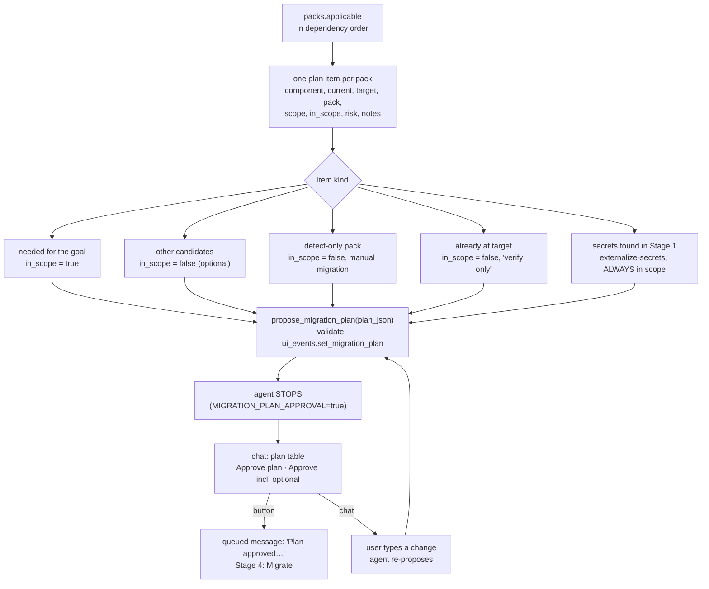

# Stage 3: Plan

Turn the applicable packs into a migration plan and stop until the user approves it.
[Index](../README.md) · Previous: [Stage 2, Discover](02-discover.md) · Next:
[Stage 4, Migrate](04-migrate.md)

## Flow



## The plan item

```json
{
  "goal": "Java 21",
  "summary": "2-4 sentences, incl. components already at target",
  "items": [
    {"component": "Struts", "current": "2.5.30", "target": "7.x per struts2-modernize",
     "pack": "struts2-modernize", "scope": "ams-internal/* (12 actions, struts.xml)",
     "in_scope": true, "risk": "medium", "notes": "…"}
  ]
}
```

`propose_migration_plan` rejects invalid JSON, an empty `items` list, or an item without
`component` and `target`. Unknown risk values become `medium`.

## How items are classified

| Item | `in_scope` | Why |
| --- | --- | --- |
| needed to reach the goal, and what those depend on | true | the migration itself |
| other applicable packs | false | optional; the user can opt in |
| `status: detect-only` pack | false | no transform guidance yet; needs a manual migration |
| matched on usage but already at the pack's target version | false | "already at target; verify only" |
| secrets found in Stage 1 | **true, always** | pack `externalize-secrets`, risk high, note "rotate after externalizing" |
| public keys found in Stage 1 | true only if the user clicked **Scrub public keys** | pack `externalize-public-keys` |

## The approval gate

| Who | Action | Result |
| --- | --- | --- |
| agent | `propose_migration_plan` | plan stored in `ui_events`; tool result says "STOP now" |
| chat | `render_migration_plan` | table, notes, two buttons |
| user | **Approve plan** | queues "Plan approved. Migrate the in-scope items exactly as proposed…" |
| user | **Approve incl. optional** | marks every item in scope, queues "Plan approved including the optional items…" |
| user | types a change | the agent revises and calls `propose_migration_plan` again |

Buttons never call the agent directly: they write `pending_input` and rerun the page, so a
click is handled exactly like a typed message.

**Approval freezes the pack set.** The Approve buttons call `ui_events.approve_packs` with the
in-scope items' pack ids (all items for "Approve incl. optional"). Those ids drive
`list_migration_files` and `check_pack_acceptance` in Stage 4, so a pack whose detect rules
stop matching mid-migration is still checked. Before approval the tools fall back to the
proposed plan's in-scope packs. See [file-selection.md](../file-selection.md).

**Sizing the plan.** Before proposing, the agent calls `list_migration_files` with the
applicable pack ids, so each item's scope is the real MUST CHANGE count and modules rather
than a guess.

With `MIGRATION_PLAN_APPROVAL=false` the tool result says "Proceed with the in-scope items"
and the agent continues without waiting; the plan is still shown.

## Settings

`MIGRATION_PLAN_APPROVAL`, `DEFAULT_UPGRADE_DETAILS` (the goal).
