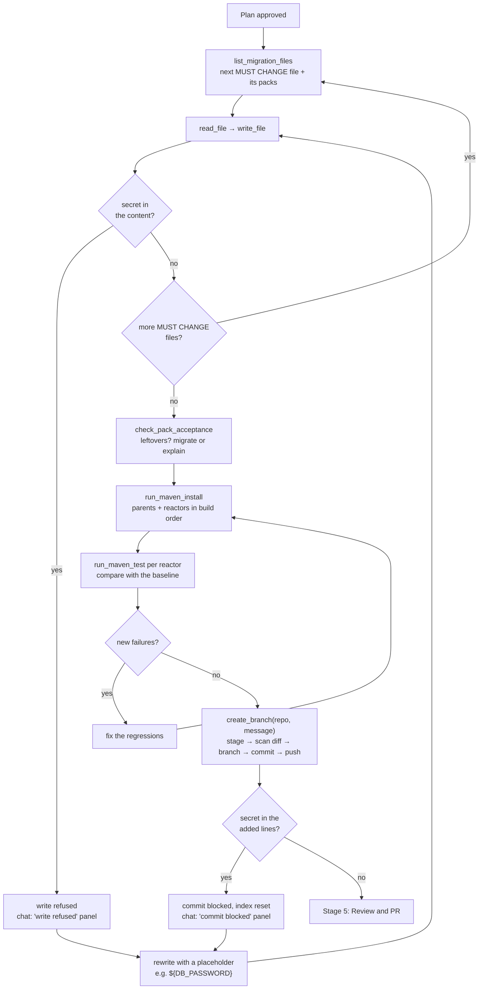
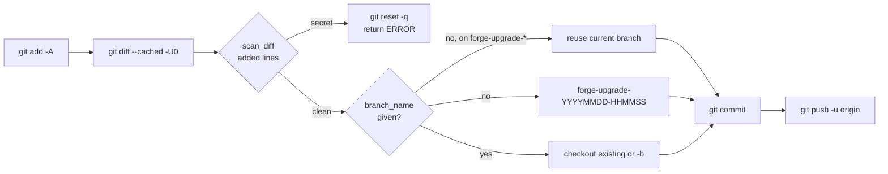
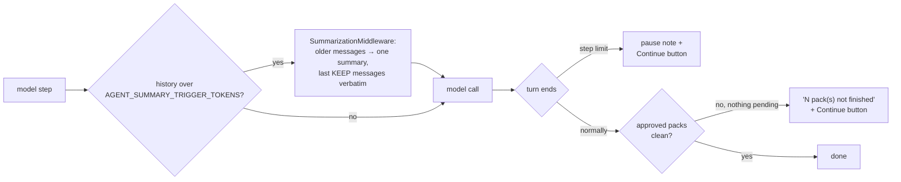

# Stage 4: Migrate

Edit the approved items, keep secrets out, test against the baseline, and push a branch.
[Index](../README.md) · Previous: [Stage 3, Plan](03-plan.md) · Next:
[Stage 5, Review and PR](05-review-and-pr.md)

## Flow



## Steps

| Step | Tool | What happens |
| --- | --- | --- |
| Pick files | `list_migration_files` | the approved packs' files: MUST CHANGE (with its packs in order) and VERIFY ONLY; see [file-selection.md](../file-selection.md) |
| Work queue | `next_migration_files` | the next files to migrate, in a fixed order (main code, then resources/webapp/config, then tests; packs in dependency order within each), with progress such as "13 of 47 files done". The agent loops on it until it is empty |
| Check | `check_pack_acceptance` | per pack: leftovers as `file:line`, `count_unchanged` vs the source branch, manual checks; must be clean or explained before Stage 5 |
| Edit | `write_file` | guarded: the content is scanned first; secret material is refused |
| Test | `run_maven_install`, `run_maven_test` | same order as the baseline; each result says new / pre-existing / fixed |
| Commit and push | `create_branch` | one call does stage, scan, branch, commit and push |
| Follow-ups | `git_commit` | later fixes on the same branch, same scan |
| Resume | `git_status` | branch, uncommitted files, last commits; used after a pause |
| Test parity | `check_test_parity` | per changed test file vs the source branch: test methods removed or renamed, fewer assertions, changed expected values. Failing files go to manual review and block the PR until fixed or approved |

## Approved means migrated

The agent works from `next_migration_files`, not from its own choice of files: a run that let the
model pick did poms and tests (the easy types) and never touched the main Java, JSPs or Struts
actions, then declared four approved packs "out of scope". Now:

- the queue fixes the order (main code first, so tests are migrated against migrated code);
- the prompt forbids descoping: "Approved plan items are never descoped, deferred or marked out of
  scope by you; only the user can accept leftovers";
- the PR gate refuses any approved pack that is not clean, whatever the description says, and the
  chat then shows **▶ Finish** and **Accept as not migrated** per pack - only your click waives a pack.

## Files that belong to several packs

A file can be selected by more than one approved pack (on ams, 33 of 134 selected files;
`BaseAction.java` by javax-to-jakarta, struts2-modernize and spring-to-spring6). Each file is migrated
**once**: the file is read once, every approved pack with work in it is applied in
dependency order, and it is written once. Acceptance is still checked per pack. Details and
diagram: [file-selection.md, "Files selected by several packs"](../file-selection.md#files-selected-by-several-packs).

## Tests keep their meaning

A migration may change **how** a test is written (JUnit 4 to 5, Mockito API), never **what**
it checks. `check_test_parity` compares each changed test file with the source branch:

| Check | Catches |
| --- | --- |
| test methods (`@Test`, `@ParameterizedTest`, `@RepeatedTest`, `@TestFactory`) | removed or renamed tests |
| assertion calls (`assert*`, `verify*`, `fail`) | fewer checks |
| string literals inside whole assertion statements | changed expected values (messages that only moved to the last argument are not flagged) |

On PR #1 of ams it flagged `WanValidatorTest` (every test renamed, 8 → 6 assertions,
"private space is rejected" turned into "private addressing is allowed") and
`LegacyAssetTagComparatorTest`, and nothing else. The JUnit pack's `test_parity` acceptance
rule uses the same check.

## Test comparison

```
vs baseline: 1 new failure(s): NewTest.breaks; 1 pre-existing (failed before the migration too): DaoTest.loadsRows; 1 fixed
ACTION: the new failures are regressions from your changes - fix them. Pre-existing failures are reported, not fixed.
```

| Result | Agent does |
| --- | --- |
| new failure | fix it |
| pre-existing | report it in the PR; do not chase it |
| fixed | mention it in the PR |
| baseline never reached the tests | every failure counts as new |

## Branch and commit



- Scanning before the branch exists means a blocked commit leaves no half-made branch.
- The tool names the branch, so the model cannot invent a timestamp or collide with an
  existing branch.
- Only **added** lines are scanned. Secrets already in untouched lines are reported by
  Stage 1, not blocked here.

## Secrets during migration

When a migration must rewrite a file that contains a reported secret, the literal is
replaced by an environment placeholder named for its purpose (`${DB_PASSWORD}`), and the
agent keeps a list of every placeholder for the PR's "Configuration required" section.
Placeholders are removed before scanning, so they never trigger the guardrail.

## Long turns

Three mechanisms keep a long migration going:



| Mechanism | What it prevents |
| --- | --- |
| **Context compaction** (`SummarizationMiddleware`, `AGENT_SUMMARY_*`) | the transcript filling up. Claude Haiku 4.5 is told its remaining context and otherwise ends the turn early with a "Still to do (due to token limits)" list |
| **Prompt rule** | "never stop because of token or context limits; keep going until `check_pack_acceptance` is clean or every leftover has a reason" |
| **Step limit** (`AGENT_RECURSION_LIMIT`) | runaway loops; hitting it pauses the turn with a **Continue where it left off** button, and the working copy keeps every edit |
| **Post-turn acceptance check** (`chat._offer_continue_if_unfinished`) | a turn that ends normally with work left. After every turn the chat runs the approved packs' acceptance checks itself; if any is unfinished and no plan or review decision is pending, it shows which packs and how many leftovers, and offers Continue |

Continue sends: "call git_status and check_pack_acceptance on repo, then finish the remaining
MUST CHANGE files and the remaining steps of the plan".

## Settings

`AGENT_RECURSION_LIMIT`, `AGENT_SUMMARY_ENABLED`, `AGENT_SUMMARY_TRIGGER_TOKENS`,
`AGENT_SUMMARY_KEEP_MESSAGES`, `MAVEN_OUTPUT_MAX_CHARS`, `SECRET_SCAN_ENABLED`,
`SECRET_SCAN_ALLOWLIST`, `GIT_COMMIT_AUTHOR_NAME`, `GIT_COMMIT_AUTHOR_EMAIL`.
