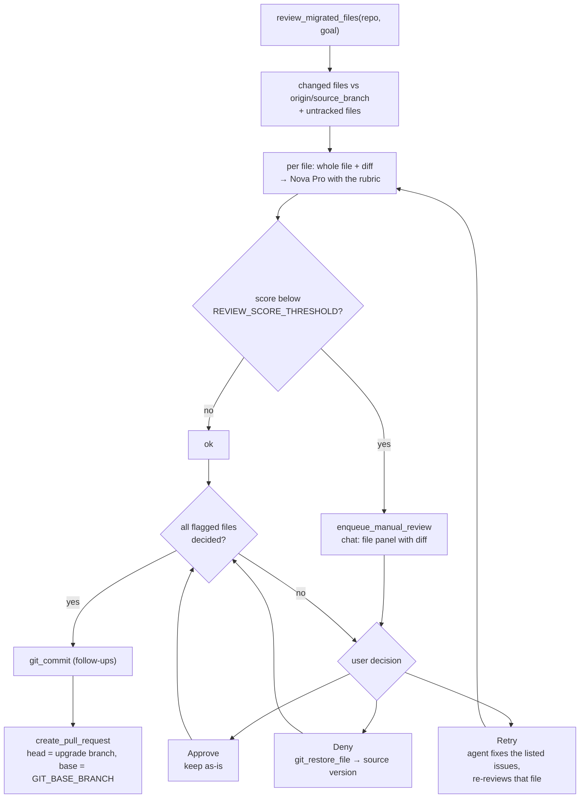
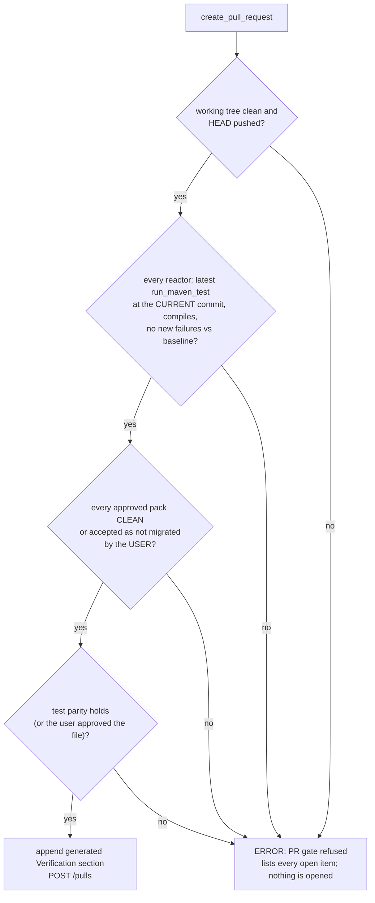

# Stage 5: Review and pull request

A second model scores every changed file; low scores wait for a human decision; then the
pull request is opened. [Index](../README.md) · Previous: [Stage 4, Migrate](04-migrate.md)

## Flow

## The reviewer

| Aspect | Value |
| --- | --- |
| Model | `REVIEWER_MODEL_ID` (Amazon Nova Pro), temperature 0, same Bedrock guardrail |
| Input | upgrade goal, file path, the **transform guidance of every approved pack that selects the file** (up to 12,000 characters), the **whole file after the migration**, and the unified diff against `origin/<GIT_SOURCE_BRANCH>` |
| Output | JSON `{score 0-10, summary, issues[{severity, description, location}]}` |
| Flagged | score below `REVIEW_SCORE_THRESHOLD` (7) |
| Failure | a reviewer error scores 0, so the file lands in manual review instead of passing silently |

Rubric:

| Score | Meaning |
| --- | --- |
| 10 | correct, complete, idiomatic for the target |
| 8-9 | correct; minor nits |
| 6-7 | mostly right; a gap a reviewer must check |
| 4-5 | likely broken or incomplete |
| 0-3 | unsafe, deleted logic, secrets, unrelated edits |

**Pack guidance is the authority.** The rubric tells the reviewer never to raise an issue that
contradicts the pack or would not compile, and names the traps seen in real runs: JDK
`javax.xml.parsers` / `javax.sql` / `javax.crypto` stay `javax` (there is no `jakarta.sql`),
JUnit 5 puts the assertion message last, Jakarta Tags 3.0 URIs are `jakarta.tags.core` /
`jakarta.tags.fmt`.

**Evidence-only rubric.** Earlier the reviewer saw only the diff with three lines of context
while being asked how *complete* the migration was, so import-only changes drew speculative
flags such as "might be using other javax APIs" at location "entire file". It now gets the
whole file, and the rubric says: judge by what is in the file, an import-only change is
complete when nothing else references the old API, every issue must cite a real line or
symbol, no "might / could / ensure" issues, and no concrete issue means 8-10. Repo-wide
completeness is checked by `check_pack_acceptance`, not by the reviewer.

## Manual review decisions

| Button | Message queued to the agent | Effect |
| --- | --- | --- |
| ✅ Approve | "Approved as-is: `<path>`. Make no further changes to it." | file kept; not raised again |
| ❌ Deny | "Rejected: `<path>`. Restore it to the source-branch version with git_restore_file…" | `git checkout origin/<source> -- <path>` |
| 🔁 Retry | "Retry: revise `<path>` … Reviewer issues: … Fix the issues that are correct. If an issue contradicts the pack guidance or would not compile, do NOT apply it: say which and cite the pack rule. Never change what a test checks." | agent fixes the valid issues, declines wrong ones with a reason, re-runs the review for that file |
| Approve all | "Approved as-is: … All flagged files are now decided" | every remaining file kept |

Each message also tells the agent how many flagged files are still waiting, so it does not
push before all are decided.

## The pull request

`create_pull_request(github_url, branch_name, pr_title, pr_description)` first runs the **PR
gate**, then posts to `https://api.github.com/repos/<owner>/<repo>/pulls` with the PAT as a
Bearer token, head = the upgrade branch, base = `GIT_BASE_BRANCH`.

**Only you can accept unfinished work.** An approved pack that is not clean blocks the PR even if
the description lists it under *Detected but not migrated*. The refusal opens a panel in the chat:

| Button | Effect |
| --- | --- |
| ▶ Finish (per pack) / ▶ Finish all | the agent migrates the remaining files from `next_migration_files`, re-runs the tests and tries again |
| Accept as not migrated (per pack) | the pack is waived (`ui_events.waive_pack`); the PR lists it as "Not migrated (accepted by the user)" |

| `PR_GATE` | When the gate fails |
| --- | --- |
| `block` (default) | nothing is opened; the agent gets the list of open items and must fix them |
| `draft` | a GitHub **draft** PR is opened with the open items at the top of the verification section |
| `off` | no gate, no generated section |

Every test result is from `run_maven_test` itself, not the model: the gate keeps a record of
the latest run per reactor together with the repository state it ran against (HEAD plus
uncommitted changes), so a run before the last edit does not count. A failure counts as
"pre-existing" only when the baseline comparison says so.

**Generated verification section.** Appended to the description from tool results:

| Part | Source |
| --- | --- |
| Tests: per reactor, before (baseline) and after (run, failing, new; or DOES NOT COMPILE) | the test-run record |
| Guideline packs: CLEAN or leftovers (`file:line`), manual checks | `check_pack_acceptance` |
| Test parity findings, files the user approved as-is | `check_test_parity`, the review panel |
| Personal data (Amazon Bedrock scan): counts by type and `file:line`, never values | `pii_scan` |
| Configuration required: environment variables read by lines the branch added (`System.getenv`, `requiredEnv`, `${X}`, `${env.X}`) | the branch diff |

The prompt asks the agent for the narrative part:

| Section | Source |
| --- | --- |
| Detected stack summary | Stage 2 `summary` |
| Detected but not migrated | `check_pack_acceptance` leftovers with reasons, plus its manual checks |
| Migration plan as a table | Stage 3 |
| Test results vs the baseline | Stage 4: new failures fixed, pre-existing listed |
| Review scores | this stage |
| Secret-scan findings | Stage 1, redacted |
| Configuration required | every placeholder introduced, with a note to rotate the originals |
| Remaining issues | anything not fixed |

After the PR the chat stays open: asking for changes produces follow-up commits on the same
branch.

## Settings

`REVIEWER_ENABLED`, `REVIEWER_MODEL_ID`, `REVIEWER_MODEL_REGION`, `REVIEWER_MAX_TOKENS`,
`REVIEW_SCORE_THRESHOLD`, `REVIEW_MAX_DIFF_CHARS`, `GIT_SOURCE_BRANCH`, `GIT_BASE_BRANCH`,
`GITHUB_API_TIMEOUT`, `GITHUB_API_VERSION`.
